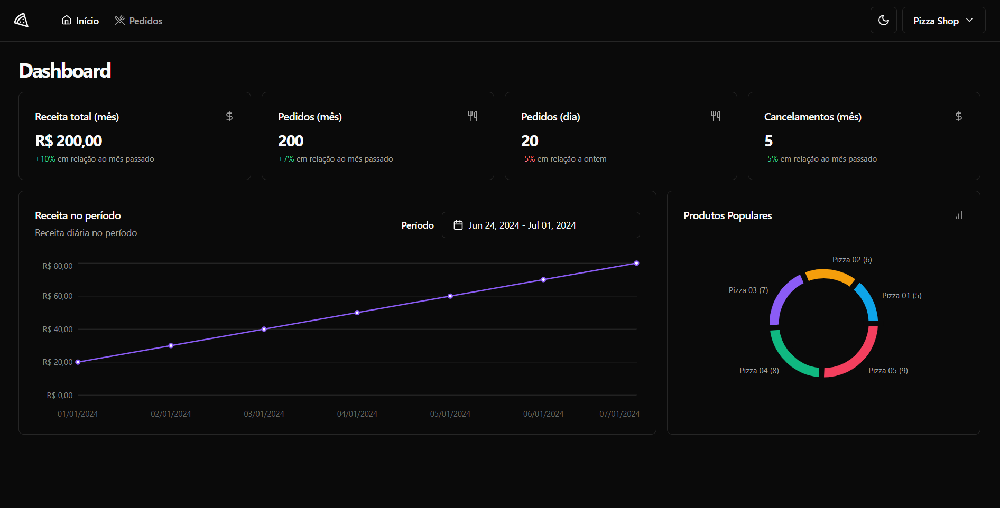

<p align="center">
  <a href="" rel="noopener">
 </a>
</p>

<h1 align="center">Pizza Shop</h1>

## 📝 Table of Contents <a name = "en"></a>
- [About](#about)
- [Getting Started](#getting_started)
- [Usage](#usage)
- [Tests](#tests)
- [Technologies](#built_using)

## 🧐 About <a name = "about"></a>
- This project is a web application for a dashboard of a pizza shop. It allows managers to control the shop metrics and its orders.
- The application was developed using TypeScript, React.js, TailwindCSS, Vite, Shadcn UI, React Hook Form and React Query.
- This application uses an authentication system with magic links, which allows users to log in without a password.

## 🏁 Getting Started <a name = "getting_started"></a>
- These instructions will allow you to get a copy of the project and run the application locally for development and testing purposes.
- The app can be used with an external API, which is available at [this repository](https://github.com/rocketseat-education/pizzashop-api). The API was built with Bun, Drizzle and PostgreSQL.
- The app can also be used with a mock API, which can be run based on which command you choose.

### Prerequisites
To run the application, you will need Node.js installed on your machine. You can download it [here](https://nodejs.org/).<br>
To use the external API, you will need Bun and Docker installed on your machine. You can download Bun [here](https://bun.red/) and Docker [here](https://www.docker.com/).

### Installation and execution
<h4>With external API</h4>
To access the project, either clone the repository or download the project files.<br>
To clone the repositories, use the following command in your terminal:

```sh
## Web
git clone https://github.com/LeonardoSPereira/Pizza-Shop

## API
git clone https://github.com/rocketseat-education/pizzashop-api
```

After cloning the repositories, access the API repository and follow the instructions in the README file to run the API.<br>
After running the API, access the web repository and use the following command in your terminal to install the dependencies. I'm using pnpm in this example, but you can use npm as well:

```sh
pnpm install
```
You will also need to configure the environment variables. To do this, create a file named <code>.env.local</code> and <code>.env.test</code>, with the credentials found in the <code>.example</code> files.<br>

After that, use the following command in your terminal to start the application:

```sh
pnpm run dev
```

This will run the application at <code>http://localhost:5173</code>. To access the application, simply open this address in your browser.

When you run the Database seed, remember to change the email registered to use yours. If you don't do this, you won't be able to log in.

After running the application, you can login with the email registered in the database. After that, a link will be displayed in the API console. Access this link to log in to the application.

**Note:** The requests have an proposital delay of random seconds to simulate a real API. If you want to change this, you can do it in the <code>src/lib/axios.ts</code> file and remove the <code>if</code> statement.

<h4>With mock API</h4>
To access the project, either clone the repository or download the project files.<br>
To clone the repository, use the following command in your terminal:

```sh
git clone https://github.com/LeonardoSPereira/Pizza-Shop
```

After cloning the repository, access the web repository and use the following command in your terminal to install the dependencies. I'm using pnpm in this example, but you can use npm as well:

```sh
pnpm install
```

You will also need to configure the environment variables. To do this, create a file named <code>.env.local</code> and <code>.env.test</code>, with the credentials found in the <code>.example</code> files.<br>

After that, use the following command in your terminal to start the application:

```sh
pnpm run dev:test
```

This will run the application at <code>http://localhost:50789</code>. To access the application, simply open this address in your browser: <code> http://localhost:50789/sign-in</code>. And use the following credentials to log in:

```sh
email: 'johndoe@example.com'
```

After that, access the following url to access the application:

```sh
http://localhost:50789/
```

## 🎈 Usage <a name="usage"></a>
To use the application, follow the instructions above and access the application. You can use the application to see the shop metrics and manage the orders.

## 🏗️ Tests <a name="tests"></a>
The app has unit tests for some components and pages and E2E tests.
To run the unit tests, use the following command in your terminal:

```sh
pnpm test
```

To run the E2E tests, use the following command in your terminal:

```sh
pnpm test:e2e

## or to run with Playwright's UI
pnpm test:e2e:ui
```

## ⛏️ Technologies <a name = "built_using"></a>
- [TypeScript](https://www.typescriptlang.org/)
- [React.js](https://reactjs.org/)
- [TailwindCSS](https://tailwindcss.com/)
- [Vite](https://vitejs.dev/)
- [Shadcn UI](https://ui.shadcn.com/)
- [Recharts](https://recharts.org/)
- [React Hook Form](https://react-hook-form.com/)
- [React Query](https://tanstack.com/query/latest/docs/framework/react/overview)
- [React Router](https://reactrouter.com/)
- [Vitest](https://vitest.dev/)
- [MSW](https://mswjs.io/)
- [Playwright](https://playwright.dev/)
- [Axios](https://axios-http.com/)